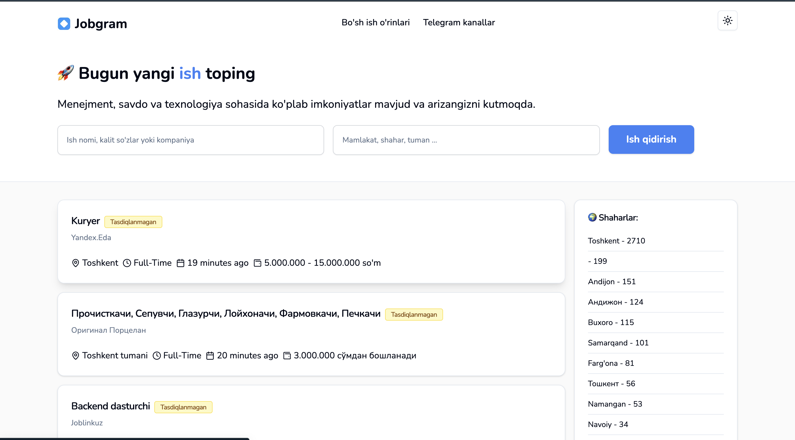
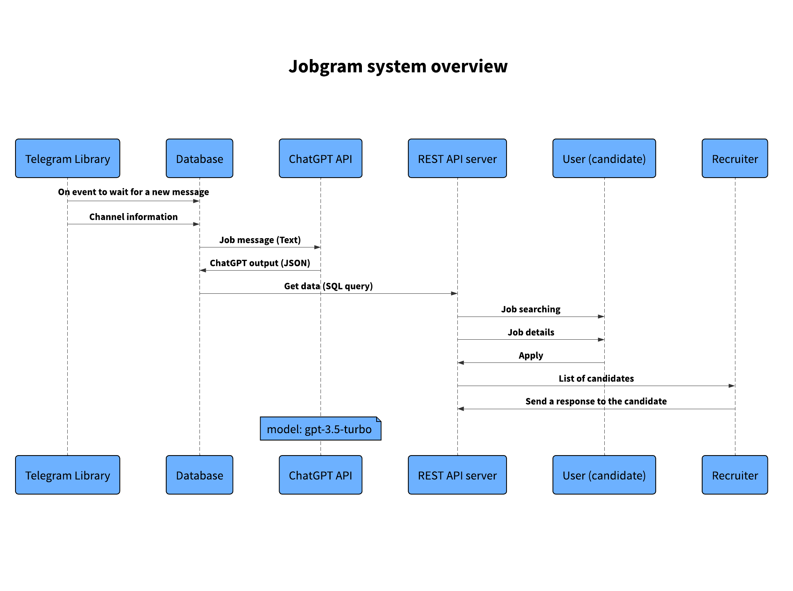

# Tech Award 2024 - Jobgram Platform

This project is a **Telegram-based job management platform** that utilizes **TDLib** (Telegram Database Library) to integrate Telegram functionalities with a user-friendly web interface built using **Node.js** and **Next.js**. It allows users to manage job postings, applications, and notifications directly through Telegram, making it easier for both recruiters and applicants to connect.

We have a comprehensive [Wiki](https://github.com/mensenvau/tech_award_2024/wiki) that includes detailed documentation about the platform’s architecture, features, integrations, and more.



## 🌟 Features

-   **Telegram Integration**: Fully automated job management system using Telegram’s API powered by TDLib.
-   **Real-time Updates**: Receive notifications, job postings, and application statuses directly via Telegram.
-   **Web Interface**: A beautifully designed and intuitive front-end using Next.js for seamless interaction.
-   **Job Posting & Tracking**: Easily create, post, and track job applications within the platform.
-   **Secure Data Handling**: User data is managed securely with modern encryption practices.

## 📊 UML Diagram

Here is an overview of the system architecture represented through a UML diagram:



## 💻 Tech Stack

-   **Backend**:
    -   [TDLib](https://core.telegram.org/tdlib): For Telegram API integration.
    -   **Node.js**: For server-side logic.
    -   **Express.js**: Lightweight server framework.
    -   **SQL Database**: For managing job postings, users, and application data.
-   **Frontend**:

    -   **Next.js**: For building the React-based web application.
    -   **CSS/Styled-Components**: For making the interface visually appealing.
    -   **Shadcn/ui**: Beautifully designed components.

-   **Workers**: Custom workers handle background tasks, like sending job notifications and syncing with Telegram.

## 📚 API Documentation

For detailed information on the API endpoints and how to interact with the Telegram Job Management Platform, please refer to our API documentation:

[**Postman API Documentation**](https://documenter.getpostman.com/view/36794346/2sAXqtbMJB)

This documentation provides comprehensive details on all available API routes, including authentication, job creation, user management, and more.

## ⚡ Google PageSpeed Insights

PageSpeed Insights Docs Enter a valid URL Analyze Make your web pages fast on all devices Check out What's new Documentation Learn about Web Performance

[PageSpeed Insights](https://pagespeed.web.dev/analysis/https-jobgram-org/ss4vj432il?utm_source=search_console&form_factor=desktop&hl=en)

## 🌐 Production App Links

You can check out the live production version of our application below:

-   **Web App**: [Production Link](https://jobgram.menda.page/)
-   **API Base URL**: [Production API](https://api.menda.page/)

## 🚀 Getting Started

Follow these instructions to set up the project on your local machine.

### Prerequisites

Make sure you have the following installed:

-   Node.js (v14+)
-   TDLib (v1.7+)
-   MySQL or any compatible SQL database
-   Telegram bot credentials (API key, etc.)

### Installation

1. Clone the repository:

    ```bash
    git clone https://github.com/your-username/tech_award_2024.git
    cd tech_award_2024
    ```

2. Install dependencies:

    ```bash
    cd /server && npm install
    cd /workers && npm install
    cd /web && npm install
    ```

3. Set up environment variables:

-   Create a `.env` file based on `.env.example` and add your **Telegram API keys**, **database credentials**, and other necessary configurations.

```bash
cp .env.example .env
```

4. Initialize the database:

```bash
mysql -u root -p < db.sql
```

5. Start the development server:

    ```bash
     cd /server && npm run start
     cd /workers && node app.js
     cd /web && npm run dev
    ```

6. Access the web app:

Open your browser and go to `http://localhost:3000`.

## 🛠️ Project Structure

```bash
├── jobs          # Background tasks like job notifications
├── server        # Server-side code (Node.js, Express)
├── web           # Frontend (Next.js)
├── workers       # Background job workers (e.g., job sync with Telegram)
├── db.sql        # SQL database structure for job postings and user data
├── package.json  # Project dependencies and scripts
├── README.md     # This file
└── .env.example  # Example environment configuration
```

## 📱 Telegram Bot Integration

Our platform leverages the **Telegram Database Library (TDLib)** to provide seamless communication between our platform and Telegram. Once set up, the bot can:

-   Send job postings directly to Telegram.
-   Notify users of new applications and status updates.
-   Allow job seekers to apply through Telegram messages.

To get started with the Telegram bot:

1. Create a bot via [BotFather](https://core.telegram.org/bots#botfather) and get your API token.
2. Add your Telegram credentials in the `.env` file.

## ✨ Key Contributions

-   **Mensenvau**: Backend logic, Telegram integration, and job management functionality.
-   **Nurmuhammad**: Backend logic and deployment assistance.
-   **Bobir Samadov**: Frontend, design, and deployment assistance.

## 🏆 Why This Project?

We believe that job applications should be as accessible as possible, and leveraging a popular platform like Telegram simplifies the process for millions of users worldwide. Our project offers a **unique and efficient solution** for managing jobs and applications directly through Telegram while providing a robust web interface for recruiters and companies.
